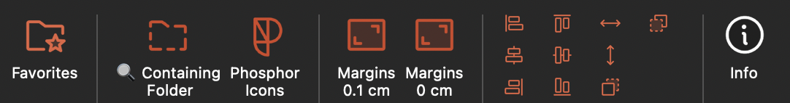

# pptNoob

A tiny PowerPoint add-in for macOS users who are stuck working with PowerPoint on a Mac and need a few missing features that the app still does not offer.

This project is intentionally small and practical: it adds a few quick actions to the PowerPoint ribbon so everyday annoyances are easier to handle without fighting the default UI.



## Why this exists

PowerPoint on Mac can be surprisingly limited compared with the Windows experience. Sometimes the missing option is tiny, but it keeps showing up every time you work on a deck.

This add-in is a gentle workaround for that reality: a few helpful shortcuts for people who are forced to use PowerPoint on Mac and just want the job done without too much friction.

## Current features

- Add, search, edit, reorder, and open favorite presentations
- Open the containing folder for the current presentation in the browser
- Search, recolor, and insert the full Phosphor icon library in six weights
- Set selected text margins to 0.1 cm
- Set selected text margins to 0 cm
- Align, distribute, and reorder selected shapes
- View add-in information, source, license, and credits

## Install on your Mac

1. Quit PowerPoint.
2. Download the latest macOS installer from [GitHub Releases](https://github.com/kl3mousse/pptnoob/releases/latest).
3. Open the downloaded `.pkg` file and follow the installation steps.
4. Reopen PowerPoint. The `pptNoob` tab should appear in the ribbon.

The installer places the add-in manifest in PowerPoint's add-in folder. The add-in itself is served securely from GitHub Pages, so feature updates normally arrive automatically. Install a newer package only when a release asks you to do so.

The installer is currently unsigned. If macOS blocks it, open System Settings → Privacy & Security and choose Open Anyway. A future signed and notarized release will remove this extra step.

## Architecture

This add-in uses the Office Web Add-in model:

- `manifest.xml` defines the custom ribbon buttons in PowerPoint
- the add-in loads static HTML/JS from a public HTTPS URL
- the actual code is hosted on GitHub Pages
- the add-in does not require a local Node server in production

The app is intentionally static. The production site is served from GitHub Pages, and the manifest points to the public URL:

https://kl3mousse.github.io/pptnoob/

Version tags also trigger `.github/workflows/release.yml`, which builds the macOS installer and attaches it to a GitHub Release.

## Local development

```bash
npm install
npm test
npm start
```

`npm start` generates a separate development manifest, starts the local HTTPS server, and opens PowerPoint with the development add-in. Look for the `pptNoob Dev` tab in the ribbon; the regular `pptNoob` tab is the installed production version.

- Changes to task pane HTML, TypeScript, or assets are rebuilt by the development server. Reload or reopen the task pane to see them.
- Changes to ribbon buttons are defined by the manifest. Run `npm stop`, quit PowerPoint, then run `npm start` again to reload them.
- Local changes are served from `https://localhost:3000` and do not affect GitHub Pages or other users.

If PowerPoint keeps an older development ribbon after restarting, run `npm stop`, delete `8e9a9f52-1d97-4cf4-82d7-3099777a0f91.manifest.xml` from `~/Library/Containers/com.microsoft.Powerpoint/Data/Documents/wef/`, and run `npm start` again. Do not delete `pptNoob.xml`; that is the installed production add-in.

## GitHub Pages deployment

This project is configured to deploy the static bundle via GitHub Actions.
The repo already includes a workflow at:

- `.github/workflows/pages.yml`

This workflow deploys it to GitHub Pages automatically on pushes to `main`

## Publishing an installer

Update the versions in `package.json` and `manifest.xml`, validate the release, then create and push a matching tag:

```bash
npm test
npm run build
npx office-addin-manifest validate manifest.xml
git tag v1.3.0
git push origin v1.3.0
```

GitHub Actions builds `pptNoob-1.3.0-macOS.pkg` and publishes it on the repository's Releases page.

## Notes

This project is meant to stay lightweight and focused on small, useful fixes rather than trying to recreate a full PowerPoint productivity suite.
